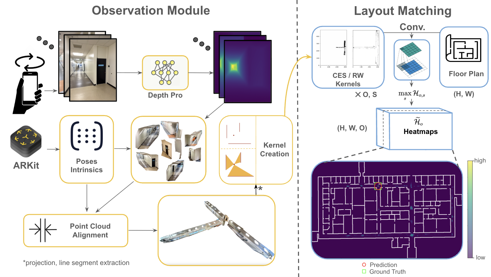
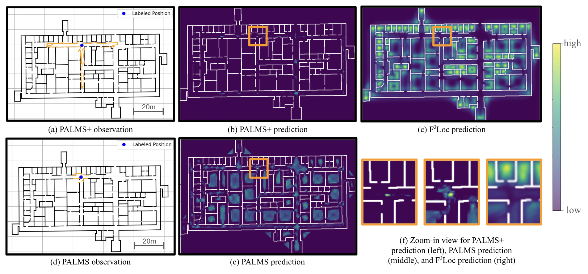
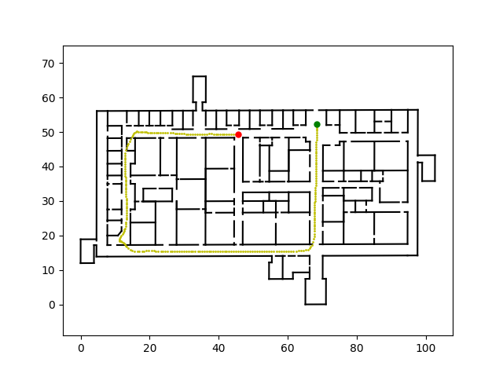
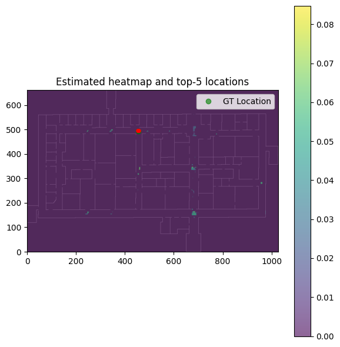
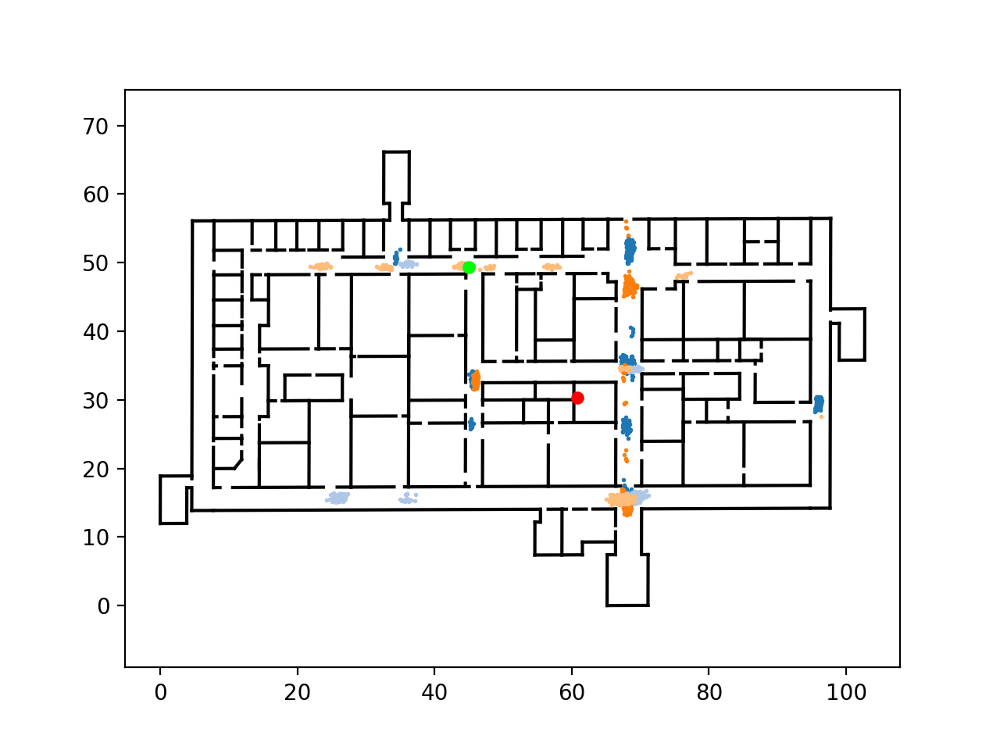

<div align="center">
<h1>PALMS & PALMS+: Plane-based Accessible Indoor Localization Using Mobile Smartphones</h1>

[**Yunqian Cheng**](http://yunqiancheng.cloud/) · [**Benjamin Princen**](https://github.com/Head-inthe-Cloud) · [**Roberto Manduchi**](https://users.soe.ucsc.edu/~manduchi/)

University of California, Santa Cruz
<br>

<a href="https://escholarship.org/uc/item/7bw6797s"></a>
<a href="https://arxiv.org/abs/2511.09724"></a>
<a href='https://github.com/Head-inthe-Cloud/PALMS-Plane-based-Accessible-Indoor-Localization-Using-Mobile-Smartphones'></a>
<!-- <a href=''></a> -->
<!-- <a href=''></a> -->
</div>


This repository contains implementations for **PALMS** and **PALMS+**, two systems for previous-visit-free indoor localization using comodity mobile devices.

**PALMS** localizes a user within a known floor plan using a one-time 3D rotational scan of the local environment (e.g. via ARKit LiDAR or similar) and IMU-based odometry. 


**PALMS+** extends PALMS by replacing LiDAR with monocular depth estimation, enabling structure-from-motion and depth fusion from RGB-only images. It reconstructs a scale-aligned global point cloud and maintains compatibility with the PALMS localization pipeline, supporting broader device compatibility without the need for depth sensors.




<!-- TODO: Add PALMS+ architecture visualization -->
<!--  -->

## News
- **2025-11-12:** **PALMS+ accepted to WACV 2026 (Application Track)!**
- **2024-10-17:** Our presentation of the PALMS paper has received the [Best Presentation award](https://ipin-conference.org/2024/awardees/) at IPIN 2024!
- **2024-07-29:** **PALMS** paper accepted to IPIN 2024!


## Overview

### 🧭 PALMS

**PALMS** (Plane-based Accessible Indoor Localization Using Mobile Smartphones) is an innovative system designed for indoor global localization and relocalization using publicly available floor plans. This project leverages smartphone LiDAR capabilities to enhance accessibility for all users, including those with visual impairments.

**Key features:**
- Particle filter initialization using the Certainly Empty Space (CES) constraint
- Principal orientation matching for improved accuracy
- No need for prior environmental fingerprinting
- Real-time localization without external infrastructure or pre-built database

### 🚀 PALMS+

**PALMS+** (Modular Image-Based Floor Plan Localization Leveraging Depth Foundation Model) is the next-generation extension of PALMS, accepted to **WACV 2026**. PALMS+ replaces LiDAR with a foundation monocular depth estimation model (Depth Pro), reconstructing scale-aligned 3D point clouds from RGB images for more robust localization.

**Key features:**
- Fully **image-based** (no LiDAR required)
- **Modular** architecture adaptable to future depth models
- Produces a **probabilistic posterior** usable for both direct and sequential localization
- Demonstrated robustness across **Structured3D** and custom campus datasets
- Outperforms PALMS and F³Loc in stationary localization accuracy



## Installation

### Prerequisites

- Python 3.10
- CUDA-capable GPU (recommended for depth estimation, but CPU is supported)

### Step 1: Clone the Repository

```bash
git clone https://github.com/Head-inthe-Cloud/PALMS-Plane-based-Accessible-Indoor-Localization-Using-Mobile-Smartphones.git
cd PALMS-Plane-based-Accessible-Indoor-Localization-Using-Mobile-Smartphones
```

### Step 2: Install Dependencies

We recommend using a conda environment for managing dependencies:

```bash
# Create and activate a conda environment (optional but recommended)
conda create -n palms python=3.10
conda activate palms

# Install dependencies
pip install -r requirements.txt
```

The `requirements.txt` file contains all necessary packages with tested versions. For a complete list of dependencies, see `requirements.txt`.

### Step 3: Set Up Depth Pro Model (for PALMS+)

Most of our data already come with pre-computed Depth Pro depth maps, if you want to re-estimate the depth maps, you will need the Depth Pro model:

1. Clone the Depth Pro repository into `ml-depth-pro/` and install the Depth Pro module:
   ```bash
   git clone https://github.com/apple/ml-depth-pro.git
   cd ml-depth-pro
   pip install -e .
   ```

2. Download the Depth Pro checkpoint by running the following command, then move the `checkpoints/` directory under the main directory:
   ```bash
   # Download depth_pro.pt using scripts from the Depth Pro repository
   source get_pretrained_models.sh

   # Move the directory
   mv ./checkpoints ../checkpoints
   ```

Alternatively, you can use other monocular depth estimation models.

## Usage

PALMS provides three main scripts for different use cases:

### 1. PALMS Algorithm (`test_palms.py`)

Runs the original PALMS algorithm using LiDAR/ARKit plane detections with particle filter tracking.

```bash
python test_palms.py --config configs/palms_config.yaml --visualize_palms --run_example
```

**Configuration file**: `configs/palms_config.yaml`

### 2. PALMS+ Algorithm (`test_pp.py`)

Runs PALMS+ using depth estimation and 3D point cloud reconstruction for single-shot localization.

```bash
python test_pp.py --config configs/pp_custom_config.yaml --visualize_obs --visualize_pcd --visualize_heatmap --run_example
```

**Configuration file**: `configs/pp_custom_config.yaml` or `configs/pp_s3d_config.yaml`

### 3. PALMS+ Sequential Tracking (`test_pp_seq.py`)

Runs PALMS+ with sequential particle filter tracking for sequential localization.

```bash
python test_pp_seq.py --config configs/pp_seq_config.yaml --visualize_obs --visualize_pcd --visualize_heatmap --visualize_palms --cache_data --run_example
```

**Configuration file**: `configs/pp_seq_config.yaml`


## Visualizations
Using the `--visualize_palms` flag, GIFs will be saved to the `results` folder, along with other visualizations. You may also use the `visualize()` function to visualize the results.


## Configuration Files

Configuration files are YAML files that control all aspects of the experiments. Here's a guide to the main parameters:

### General Settings

- `resolution`: Map resolution in meters per pixel (default: 0.1)
- `num_iterations`: Number of iterations to run (for statistical evaluation)
- `method`: Algorithm to use - "PALMS" or "PALMS+"
- `dataset`: Dataset type - "custom", "pano_sample", or "s3d"

### Particle Filter Settings (`pf_config`)

- `pf_global_init`: Use global initialization (True) or local initialization (False)
- `init_method`: Initialization method - "palms", "uniform", or "uni_ori"
- `pf_init_method`: Particle selection - "percentile" or "random"
- `particle_num`: Number of particles (typically 500-2000)
- `mag_sigma`: Odometry magnitude noise standard deviation
- `angle_sigma`: Odometry orientation noise standard deviation
- `drift_sigma`: Drift noise standard deviation
- `resample_radius`: Resampling radius in meters

### Layout Matching Settings

- `alpha`: Weighting factor for heatmap generation
- `gaussian_kernel_config`: [kernel_size, sigma] for CES kernel
- `orn_slice`: Number of orientation slices (0 = principal orientations, >0 = top-k relative orientations)
- `scale_range`: Scale sweep range (for PALMS+ only)
  - `start`: Starting scale factor
  - `stop`: Ending scale factor (exclusive)
  - `step`: Step size

### PALMS+ Specific Settings

- `mde`: Monocular depth estimation model ("dp" for Depth Pro)
- `scale_alignment_mode`: Point cloud alignment method
  - "all": Use all alignment methods
  - "ground_overlap": Use ground plane overlap
  - "ground": Use ground plane only
  - "None": No alignment
- `mask_depth`: Mask depth values based on semantic classes
- `remove_flying_particles`: Remove flying particle artifacts in point cloud

## Dataset Preparation

### Data Structure

Your dataset should be organized as follows:

```
your_dataset/
├── scene_id_1/
│   └── Session_XXXXX/
│       ├── images/              # RGB images
│       ├── intrinsics/          # Camera intrinsic matrices (JSON)
│       ├── poses/               # Camera poses (JSON)
│       ├── detectedPlanes.json  # (For PALMS) Detected planes from ARKit
│       └── label.txt            # Ground truth pose [x, y, theta]
├── scene_id_2/
│   └── ...
└── ...
```

### Floor Plans

Floor plans should be CSV files with line segments, where each line represents a wall segment:
- Format: `x1, y1, x2, y2` (start and end points of segment)
- Place floor plans in a `maps/` directory (or set `PALMS_MAPS_DIR` environment variable)
- Name files as `{scene_id}.csv` (e.g., `BE.csv`, `PS.csv`)

### Tracking Data (for Sequential Localization)

For `test_pp_seq.py`, you need odometry tracking data:
- ARKit or RoNIN tracking trajectories in JSON format
- Pairing file (`tracking_obs_pairs.csv`) mapping observations to tracking sequences

### Example Data
The repository includes example data in `example/` that you can use to test the installation. Use the `--run_example` flag to try it out!

See the following for example visualizations:

<table>
  <tr>
    <td align="center">
      <b>Ground Truth</b><br>
      
    </td>
    <td align="center">
      <b>Heatmap</b><br>
      
    </td>
  </tr>
  <tr>
    <td colspan="2" align="center">
      <b>Animation</b><br>
      
    </td>
  </tr>
</table>


## Dataset
We are currently preparing the code and dataset for public release. Releasing the dataset requires extra care as some images contain human subjects. While we have blurred all humans in the images, we are taking extra precautions to ensure our data release is legitimate and complies with all necessary privacy and ethical guidelines. The dataset will be made available once these considerations are fully addressed. Stay tuned!


## Project Structure

```
PALMS-Plane-based-Accessible-Indoor-Localization-Using-Mobile-Smartphones/
├── configs/                    # Configuration YAML files
├── layout_matching_module/    # CES (Certainly Empty Space) heatmap generation
├── observation_module/         # Point cloud reconstruction and depth estimation
├── palms_src/                  # Particle filter and simulator
├── pp_src/                     # PALMS+ constants and utilities
├── utils/                      # Utility functions (geometry, I/O, visualization)
├── test_palms.py              # PALMS algorithm script
├── test_pp.py                 # PALMS+ single-shot localization
├── test_pp_seq.py             # PALMS+ sequential tracking
├── estimate_depths.py         # Standalone depth estimation utility
└── requirements.txt           # Python dependencies
```

## Troubleshooting

If you encounter any bugs in the code, we welcome you to report them by creating an issue in the [GitHub repository](https://github.com/Head-inthe-Cloud/PALMS-Plane-based-Accessible-Indoor-Localization-Using-Mobile-Smartphones/issues). Please include details about the error, your environment, and steps to reproduce the issue.

## Contact

For any questions or inquiries, please contact:

- Yunqian Cheng: [ychen827@ucsc.edu](mailto:ychen827@ucsc.edu)


## Acknowledgement

**PALMS**  
Research reported in this publication was supported by the National Eye Institute of the National Institutes of Health under award number R01EY029260-01. The content is solely the responsibility of the authors and does not necessarily represent the official views of the National Institutes of Health.

**PALMS+**  
This research was funded in part by the National Eye Institute (NIH) under grant number R01EY036360. The authors would like to thank Loni Halsted-Ruelas for her invaluable assistance with dataset curation and experimental support.


<!-- ## LICENSE -->

## Note on Documentation

⚠️ **Disclaimer**: The documentation in this repository is partly generated by AI and may contain errors. Please verify any information before relying on it for critical tasks.

## Citation

If you find this project useful, please consider citing:

### PALMS (IPIN 2024)

```bibtex
@article{Cheng_Manduchi_2024,
  title={PALMS: Plane-based Accessible Indoor Localization Using Mobile Smartphones},
  author={Cheng, Yunqian and Manduchi, Roberto},
  journal={eScholarship, University of California},
  url={https://escholarship.org/uc/item/7bw6797s},
  year={2024},
  month={Aug}
}
```

### PALMS+ (WACV 2026)

```bibtex
@article{Cheng_Princen_Manduchi_2025,
  title={PALMS+: Modular Image-Based Floor Plan Localization Leveraging Depth Foundation Model},
  author={Cheng, Yunqian and Princen, Benjamin and Manduchi, Roberto},
  journal={arXiv preprint arXiv:2511.09724},
  year={2025},
  note={Accepted to IEEE/CVF Winter Conference on Applications of Computer Vision (WACV) 2026, Application Track},
  url={https://arxiv.org/abs/2511.09724}
}
```

